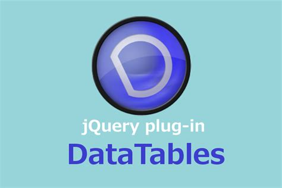
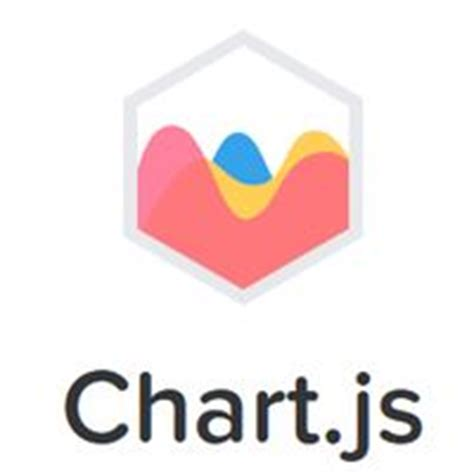
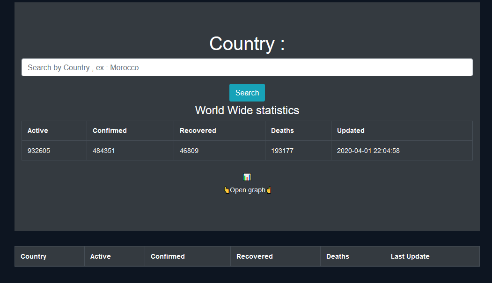
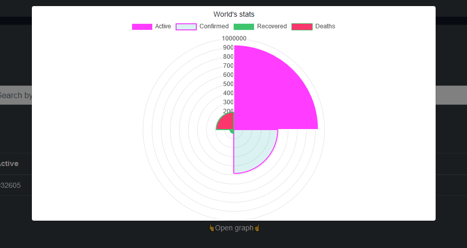
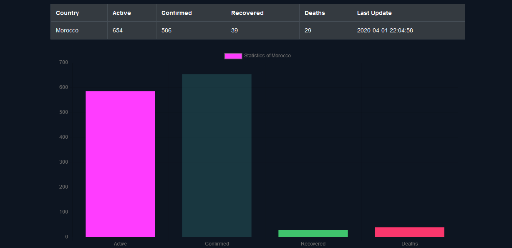
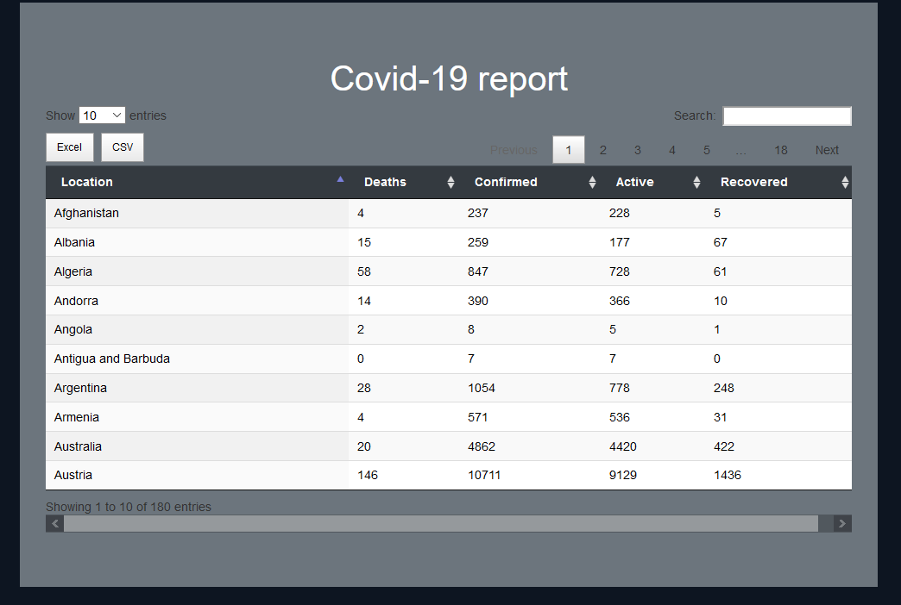

# Covid-19 Reporter

A simple webapp that consumes the 'https://covid2019-api.herokuapp.com/v2/' api 👁️ and displays the details .
the app is powered by chartJs 📊, datatables 🧾 , bootstrap , javascript , jquery and ajax.







## World data in polarGraph mode



## Custom search



## All data



## Project setup

```
click and load , nothing fancy here .
```

### Notice

```
You can use the project , modify it in any way you wish as long as you credit me !
you can reach me @ZTF666@protonmail.ch
```
